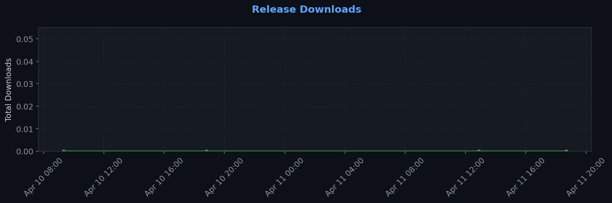
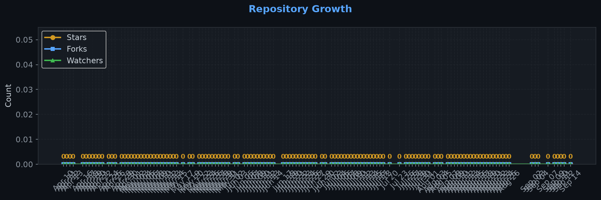

# Repository Traffic Dashboard

**Last updated:** 2026-04-11T18:40:37Z
**Days tracked:** 2 | **Download snapshots:** 4 (hourly)

---

## Views & Clones (14-day window, preserved forever)

| Metric | 14-Day Total | Unique |
|--------|-------------|--------|
| Page Views | 0 | 0 |
| Git Clones | 0 | 0 |

---

## Visitor Engagement

> Higher = visitors exploring more pages. 1.0 = bounce. 3.0+ = deeply engaged.

---

## Conversion Funnel

---

## Total Acquisition per Release (Downloads + Clones)

| Channel | Count |
|---------|-------|
| Zip Downloads | 0 |
| Git Clones (14-day) | 0 |
| **Total Acquisitions** | **0** |

---

## Referrers

| Source | Views | Unique |
|--------|-------|--------|

---

## Repository Growth

| Metric | Current |
|--------|---------|
| Stars | 0 |
| Forks | 0 |
| Watchers | 0 |

---

## Top Pages (14-day)

| Page | Views | Unique |
|------|-------|--------|

---

## Data Files

| File | Description | Granularity |
|------|-------------|-------------|
| [daily.json](daily.json) | Views & clones per day (never expires) | Daily |
| [downloads.json](downloads.json) | Release download snapshots | Hourly |
| [referrers.json](referrers.json) | Referrer snapshots | Daily |
| [metadata.json](metadata.json) | Stars, forks, watchers | Daily |
| [stats.json](stats.json) | Combined legacy snapshots | 6-hourly |

---
*Hourly download tracking + full dashboard with engagement metrics every 6 hours*
*Auto-generated by [traffic-stats.yml](../../.github/workflows/traffic-stats.yml)*
